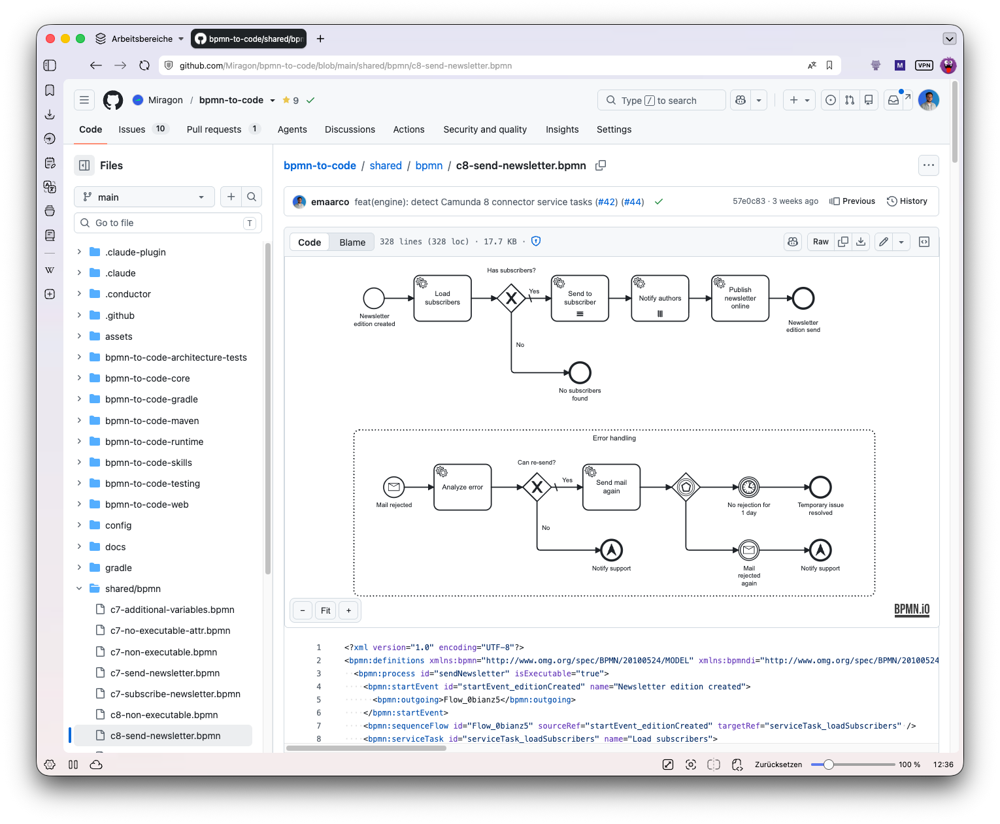

# bpmn-io-browser-plugin

[](https://github.com/emaarco/bpmn-io-browser-plugin/actions/workflows/ci.yml)
[](./LICENSE)

> A browser extension (Chrome, Edge, Firefox) that renders **BPMN & DMN diagrams
> inline** on GitLab and GitHub — and shows a **visual before/after diff** in
> merge and pull requests.



## Why

BPMN and DMN files are XML. On a git host that means a code review of a process
change is a wall of `<bpmn:sequenceFlow>` — you can't _see_ what actually moved,
got added, or was removed. This extension puts the real diagram back where the
review happens: it draws the model inline on the file, and in a pull/merge
request it highlights the **added / removed / changed / moved** elements over a
before/after view.

It's built on the [bpmn.io](https://bpmn.io) toolkits
([bpmn-js](https://github.com/bpmn-io/bpmn-js),
[dmn-js](https://github.com/bpmn-io/dmn-js)), and grew out of two internal
Tampermonkey userscripts, now reworked into a tested, store-ready extension.

## Features

- **Inline viewer** — open a `.bpmn` / `.dmn` file on GitLab or GitHub and the
  diagram appears above the source (drag to pan; the +/− and fit buttons zoom).
- **Merge / pull-request diff** — every changed `.bpmn` in an MR/PR (and on a
  GitHub single-commit page) gets a before/after view that marks added / removed
  / changed / moved elements (semantic diff, including `zeebe:*` properties) with
  prev/next navigation.
- **Standalone viewer** — a built-in page to drop in any local `.bpmn` / `.dmn`
  file; nothing leaves your machine, no site permissions needed.
- **Self-hosted** — one click (toolbar icon or right-click) grants the viewer on
  your GitLab EE / GitHub Enterprise instance; manage domains in the options page.
- **Private repos** — public repos, GitLab and GitHub Enterprise work out of the
  box. **Private repos on github.com** additionally need you to install the
  GitHub App and click **Connect GitHub** in the options page, because github.com
  serves its API from a separate origin (`api.github.com`) your login cookie can't
  reach. No token to create by hand — the app grants read-only access to just the
  repos you install it on.

## Install

Not on the stores yet — build it once and load it as an unpacked extension:

```bash
npm install
npm run build -w @bpmn-io-browser-plugin/extension
```

Then load the output for your browser:

- **Chromium** (Chrome, Edge, Brave, Vivaldi, Opera, Arc): open the extensions
  page, enable **Developer mode**, **Load unpacked** →
  `packages/extension/.output/chrome-mv3`.
- **Firefox**: `about:debugging#/runtime/this-firefox` → **Load Temporary
  Add-on** → `packages/extension/.output/firefox-mv3/manifest.json`.

`gitlab.com` and `github.com` work immediately; for a self-hosted instance, open
a `.bpmn` file there and click the extension's toolbar icon to grant access. For
**private github.com repositories**, install the GitHub App and click **Connect
GitHub** in the options page (see **Private repos** above).

> Full per-browser instructions (permanent Firefox installs, signing, dev mode)
> are in [CONTRIBUTING.md](./CONTRIBUTING.md#loading-the-extension-unpacked).

## Privacy

The extension collects **no data** — it only fetches file contents from the git
host you're already viewing. See [PRIVACY.md](./PRIVACY.md).

## Contributing

Contributions are welcome — see [CONTRIBUTING.md](./CONTRIBUTING.md) for the
monorepo layout, scripts, and how to build, test, and load the extension locally.

## Credits

- [bpmn-js](https://github.com/bpmn-io/bpmn-js) and
  [dmn-js](https://github.com/bpmn-io/dmn-js) by [bpmn.io](https://bpmn.io) — the
  toolkits that render every diagram.

## License

[MIT](./LICENSE) © Marco Schäck
